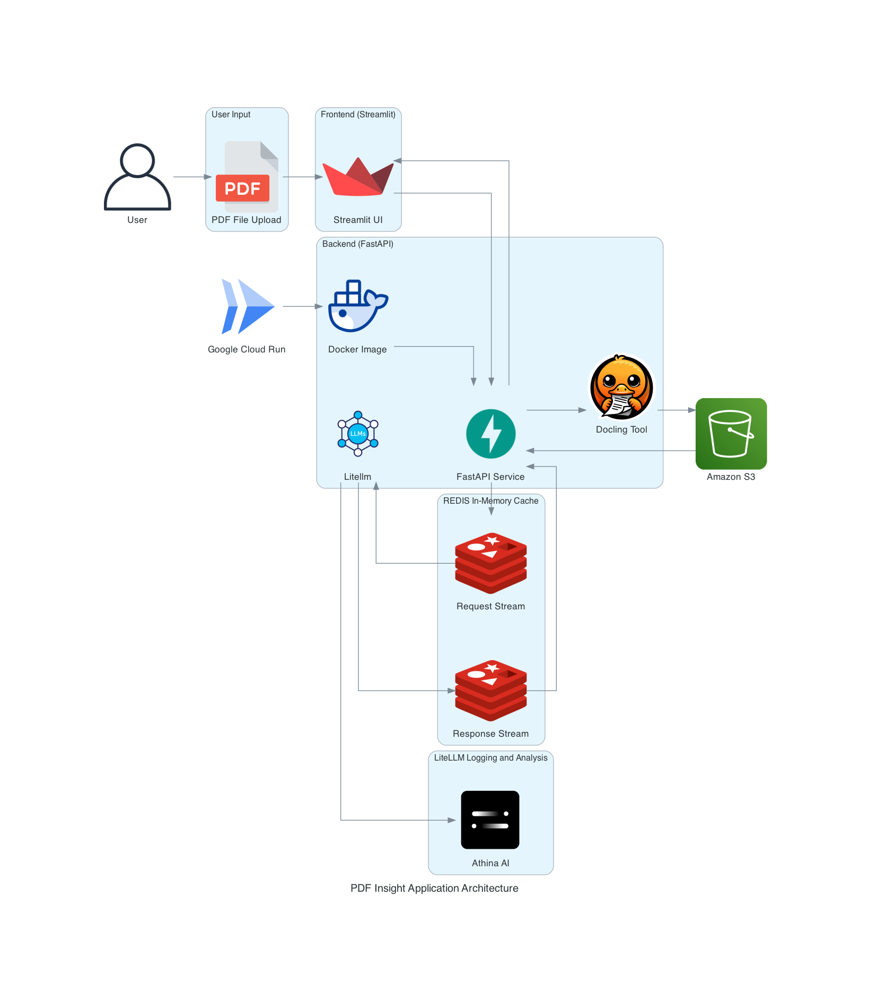

# DAMG7245_Assignment04_Part01

## Project Overview

## Team Members

- Vedant Mane
- Abhinav Gangurde
- Yohan Markose

## Attestation:

WE ATTEST THAT WE HAVEN’T USED ANY OTHER STUDENTS’ WORK IN OUR ASSIGNMENT AND ABIDE BY THE POLICIES LISTED IN THE STUDENT HANDBOOK

## Resources

Application: [Streamlit Deployment](https://pdfinsight.streamlit.app/)

Backend FastAPI: [Google Cloud Run](https://fastapi-service-pz3ijhmorq-uc.a.run.app/docs)

Redis Endpoint: [Redis Streams](https://redis-18117.c261.us-east-1-4.ec2.redns.redis-cloud.com:18117)

Google Codelab: [Codelab]()

Google Docs: [Project Document]()

Video Walkthrough: [Video]()


## Technologies Used

- **Streamlit**: Frontend Framework
- **FastAPI**: API Framework
- **Docling**: PDF Document Data Extraction Tool
- **AWS S3**: External Cloud Storage
- **Redis Streams**: Efficient queue-based request processing
- **LiteLLM**: Model-agnostic interface for LLMs
- **Google Cloud Run**: Backend Deployment

## Application Workflow Diagram



### Workflow

1. User uploads a PDF or provides a URL.  

2. Content is extracted and stored in AWS S3.

3. User selects a document and requests a summary or asks a question.

4. The request is sent to Redis, where a worker processes it using LiteLLM.

5. The response is pushed back to Redis and retrieved by FastAPI.

6. Finally, the FastAPI pushes the responses to the Streamlit AUI.

## Data Flow & API Processes

### 1. User Input

Users interact with the system through the **Streamlit frontend** or API calls, providing input in the form of:
- **PDF content**: Users can upload a PDF document for content extraction and processing.
- **SUummary**: Users can request summary of the uploaded document.
- **Query**: Users can ask questions related to the uploaded document.

### 2. Frontend (Streamlit)
The frontend, built using **Streamlit**, provides a user-friendly interface for:
- **Uploading PDFs** for content extraction and processing.
- **Displaying summaries** of the uploaded PDF content.
- **Allowing users to ask questions** based on the content of the uploaded document.

### 3. Backend (FastAPI)
The **FastAPI** backend receives the user inputs and processes them:
- It handles **PDF uploads**, including content extraction and storage in S3.
- It manages document interactions with **Redis Streams** for asynchronous task processing.
- FastAPI routes include:
  - **/upload_pdf**: To upload and process PDFs.
  - **/summarize**: To summarize document content.
  - **/ask-question**: To answer user queries based on the document content.

### 4. Redis (Streams)
Redis Streams are used for managing **asynchronous task processing**:
- When a request is received by FastAPI, it is added to the **request stream**.
- Requests are categorized and processed through the **consumer group**.
- Once a request is processed, the response is added to the **response stream**.

This approach decouples the request handling from immediate response generation, enabling scalable and efficient task management.

### 5. Redis (Worker)
The **Redis Worker** listens to the **request stream** for new tasks. Once a task is detected:
- The worker processes the request, interacts with the **LiteLLM model**, and generates the appropriate response.
- After processing, the worker pushes the response to the **response stream**.
- The worker is designed to handle error logging and ensures any issues in task processing are managed appropriately.

### 6. LiteLLM
The **LiteLLM** model is utilized to:
- Generate **summaries** of the document content.
- Provide answers to **user questions** based on the content of the uploaded PDF.
- The model interacts with the **request prompt** and outputs a response, which is returned via the Redis worker to the frontend or user.

### 7. Processing Components
The backend utilizes various components for processing PDFs:
- **PDF Extraction**: Using the `pdf_docling_converter` to extract and process data from uploaded PDFs.
- **S3 File Storage**: PDFs and extracted content are stored in **AWS S3** for long-term storage and retrieval.
- **Redis**: Redis handles message queuing and asynchronous task execution, connecting the FastAPI backend and the Redis worker for processing requests.

### 8. Deployment & Execution
- The **FastAPI backend** is deployed on a cloud server (e.g., AWS, Heroku, etc.).
- **Redis** is deployed on a cloud service to ensure high availability and scalability.
- The **Streamlit frontend** can be hosted on a platform such as **Streamlit Cloud** or **Heroku**, providing users with easy access to interact with the system.
- **AWS S3** is used for storing uploaded PDF files and extracted content, offering scalable storage solutions.
- The system is monitored continuously to ensure smooth operation, with regular updates and deployments as required.


## Installation Steps

```
Required Python Version 3.12.*
```

### 1. Cloning the Repository

```bash
git clone https://github.com/BigDataIA-Spring2025-4/DAMG7245_Assignment04_Part01.git
cd DAMG7245_Assignment04_Part01
```

### 2. Setting up the virtual environment

```bash
python -m venv venvsource venv/bin/activate
pip install -r requirements.txt
```

### 3. AWS S3 Setup

**Step 1: Create an AWS Account**

- Go to [AWS Signup](https://aws.amazon.com/) and click **Create an AWS Account**.
- Follow the instructions to enter your email, password, and billing details.
- Verify your identity and choose a support plan.

**Step 2: Log in to AWS Management Console**

- Visit [AWS Console](https://aws.amazon.com/console/) and log in with your credentials.
- Search for **S3** in the AWS services search bar and open it.

**Step 3: Create an S3 Bucket**

- Click **Create bucket**.
- Enter a unique **Bucket name**.
- Select a region closest to your users.
- Configure settings as needed (e.g., versioning, encryption).
- Click **Create bucket** to finalize.

### 4. LiteLLM Environment Setup

### 5. Setting up Redis Streams

### 6. Google Cloud SDK Setup

**Step 1: Download and Install Google Cloud SDK**

- Visit the [Google Cloud SDK documentation](https://cloud.google.com/sdk/docs/install) for platform-specific installation instructions.
- Download the installer for your operating system (Windows, macOS, or Linux).
- Follow the installation steps provided for your system.

**Step 2: Initialize Google Cloud SDK**

- Open a terminal or command prompt.
- Run `gcloud init` to begin the setup process.
- Follow the prompts to log in with your Google account and select a project.

**Step 3: Verify Installation**

- Run `gcloud --version` to confirm installation.
- Use `gcloud config list` to check the active configuration.

### 7. Deploying FastAPI Service on Google Cloud Run

1. **Build the Docker Image**

```docker
# Build and tag your image (make sure you're in the project directory)
docker build --platform=linux/amd64 --no-cache -t gcr.io/<YOUR_PROJECT_ID>/fastapi-app .
```

2. **Test Locally (Optional but Recommended)**

```docker
# Run the container locally
docker run -p 8080:8080 gcr.io/<YOUR_PROJECT_ID>/fastapi-app

# For Managing Environment Variables
docker run --env-file .env -p 8080:8080 gcr.io/<YOUR_PROJECT_ID>/fastapi-app
```

Visit http://localhost:8080/docs to verify the API works.

3. **Push to Google Container Registry**

```docker
# Push the image
docker push gcr.io/<YOUR_PROJECT_ID>/fastapi-app
```

4. **Deploy to Cloud Run**

```bash
gcloud run deploy fastapi-service \
  --image gcr.io/<YOUR_PROJECT_ID>/fastapi-app \
  --platform managed \
  --region us-central1 \
  --allow-unauthenticated  
```

5. **Get your Service URL**

```bash
gcloud run services describe fastapi-service \
  --platform managed \
  --region <REGION> \
  --format 'value(status.url)'
```

6. **Check Application Logs**

```bash
gcloud run services logs read fastapi-service --region <REGION>
```

## Repository Structure

## References

[Streamlit documentation](https://docs.streamlit.io/)

[FastAPI Documentation](https://fastapi.tiangolo.com/)

[Docling Documentation](https://ds4sd.github.io/docling/)

[Redis Documentation](https://redis.io/docs/latest/develop/data-types/streams/)

[LiteLLM Documentation](https://docs.litellm.ai/docs/)

[Open AI Documentation](https://platform.openai.com/docs/models)

[Gemini AI Documentation](https://docs.aimlapi.com/api-references/text-models-llm/google/gemini-1.5-pro)

[Grok xAI Documentaiton](https://docs.x.ai/docs/tutorial)

